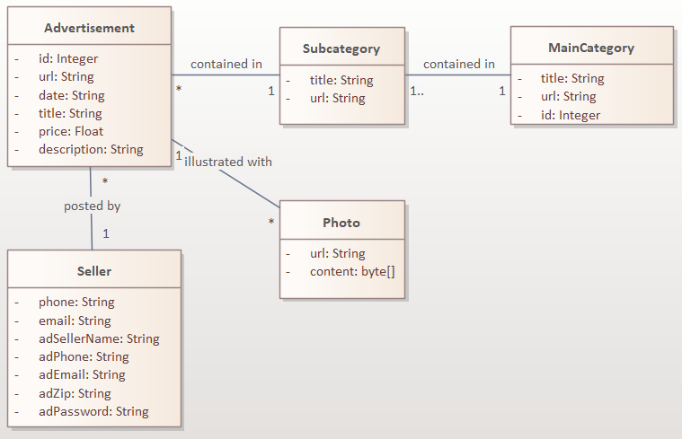
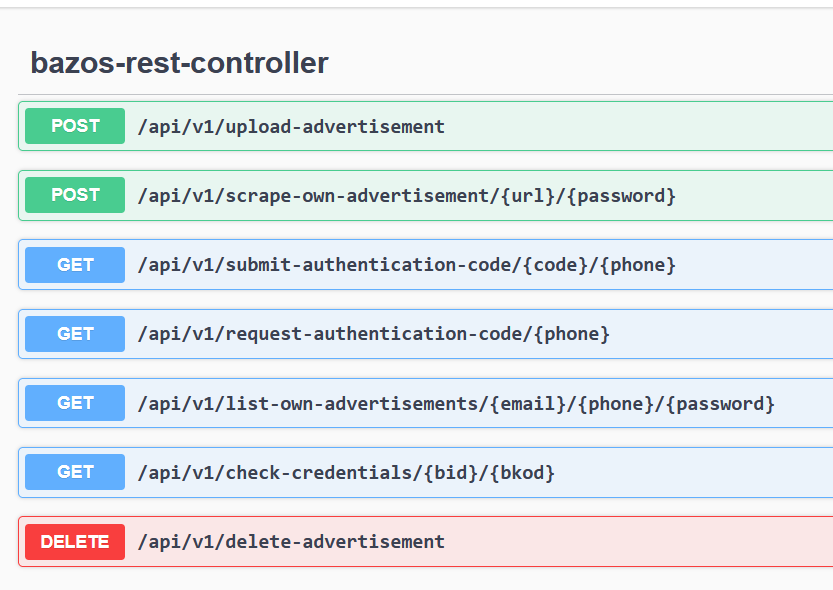

# Bazos.cz REST Api 0.9.0

This is a REST API for interacting with bazos.cz

## Domain model

## Build

I used JDK 17 and IntelliJ.

## Documentation

When you run the project, the API is documented using swagger:

http://127.0.0.1:8080/swagger-ui/index.html

The specification is available to download using the following url:
http://localhost:8080/v3/api-docs/

