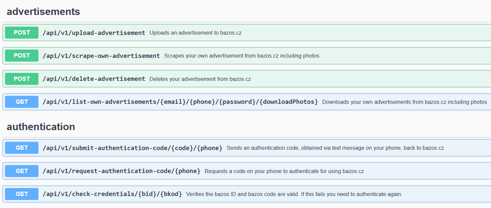

# Bazos.cz REST Api 0.8.2
This is a REST API for interacting with bazos.cz

## Domain model


## Build
I used JDK 17 and IntelliJ.

To build a docker image, run
```gradlew bootBuildImage```

## Execution
```gradlew bootRun```

## Documentation
When you run the project, the API is documented using swagger:

http://127.0.0.1:8080/swagger-ui/index.html


