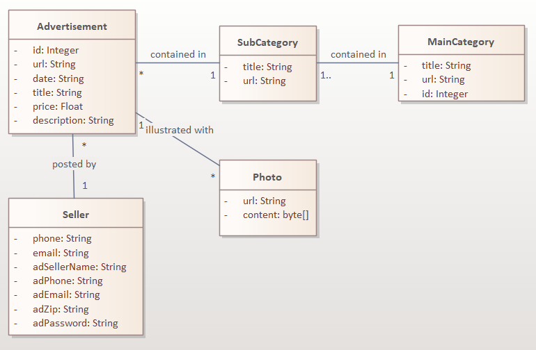
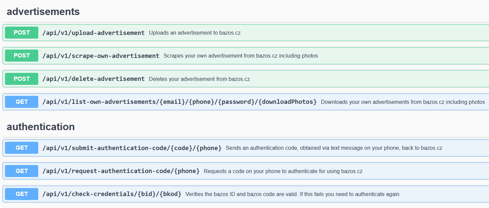

# Bazos.cz REST Api 0.9.2

This is a REST API for interacting with bazos.cz

## Domain model



## Build

I used JDK 17 and IntelliJ.
The build command is ```gradlew build```

To build a docker image, run the previous command and then
```docker build -t bazoscz-server .```

## Execution
You can execute this Java application using
```gradlew bootRun``` 
or 
```java -jar build/libs/bazosczserver-<version>.jar```

In case you have a docker image, create an empty "cookies" directory
and create a new container named bazos:
```docker run --name bazos -d -p 8080:8080 -v cookies:/app/cookies bazoscz-server```

If you intend to expose the container via the network be careful about security vulnerabilities in 3rd party packages.

## Documentation

When you run the project, the API is documented using swagger:

http://localhost:8080/swagger-ui/index.html

The specification is available to download using the following url:
http://localhost:8080/v3/api-docs/


